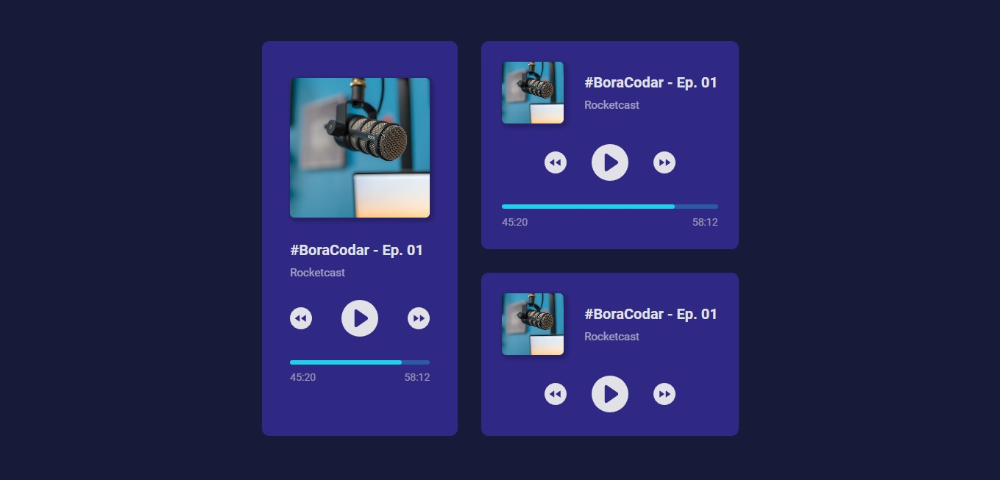

<h1 align="center"> #BoraCodar - Desafio da Semana</h1>

Projeto de um player de música desenvolvido no desafio #BoraCodar da Rocketseat.   

  <a href="#-tecnologias">Tecnologias</a>&nbsp;&nbsp;&nbsp;|&nbsp;&nbsp;&nbsp;
  <a href="#-projeto">Projeto</a>&nbsp;&nbsp;&nbsp;|&nbsp;&nbsp;&nbsp;
  <a href="https://gabriel-adsv.github.io/estiloux-frontend/" target="_blank">Layout</a>&nbsp;&nbsp;&nbsp;|&nbsp;&nbsp;&nbsp;
  <a href="#memo-licença">Licença</a>

  

 

  

## 🚀 Tecnologias
Esse projeto foi desenvolvido com as seguintes tecnologias:
- HTML
- CSS

## 💻 Projeto
Atividade feita no desafio proposto pela Rocketseat. 
- [Acesse o projeto finalizado, online](https://gabriel-adsv.github.io/estiloux-frontend/)

## 📝 Licença
Esse projeto está sob a licença MIT.

---
Feito com ♥ by Gabriel Augusto